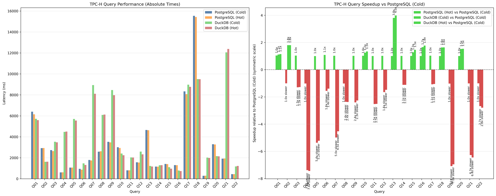
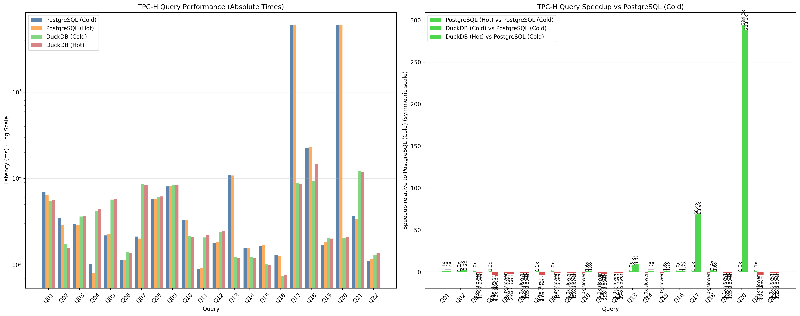

# TPC-H benchmark scripts

First you should have a Postgres server running with pg_duckdb installed. The
easiest way to do this is using docker:

```bash
# Simply run this to enable motherduck:
docker run --rm -e POSTGRES_HOST_AUTH_METHOD=trust --network=host -d --name pgduck -e MOTHERDUCK_TOKEN \
    pgduckdb/pgduckdb:17-main
# For real benchmarks it's recommended to configure Postgres its its settings,
# as well as docker its --shm-size to be a good match for your machine. For the
# best results this obviously requires tuning.
# A decent starting point for an AWS c6a.8xlarge (32 vCPU, 64GB RAM) instance
# is something like this:
docker run --rm -e POSTGRES_HOST_AUTH_METHOD=trust --network=host -d --name pgduck -e MOTHERDUCK_TOKEN \
    --shm-size=64g \
    pgduckdb/pgduckdb:17-main \
    -c shared_buffers=32GB \
    -c max_parallel_workers=32 \
    -c max_parallel_workers_per_gather=8 \
    -c duckdb.max_workers_per_postgres_scan=8 \
    -c duckdb.threads_for_postgres_scan=8
```

Then clone this repository and install the dependencies:
```

After that you can use `./run.py` (see `run.py --help` for details) to run a
TCPH-like benchmark. Check `./run.py --help` for details on the arguments. A
simple example that compares the DuckDB engine and the Postgres engine on an
extremely tiny dataset dataset (for real performance comparisons real use scale
factors of 1 or higher):

```bash
./run.py --scale-factor 0.01 --duckdb-engine --pg-engine
# Or if you want to compare without indexes
./run.py --scale-factor 0.01 --duckdb-engine --pg-engine --no-indexes
# Or with only primary key indexes
./run.py --scale-factor 0.01 --duckdb-engine --pg-engine --pk-only
```

## Results

The results will then create a nice graph. These are from a run with all the indexes with scale factor 10 on a c6a.8xlarge instance with the settings from example above:


And this is the same setup, but with only primary keys created. Here you can see that the left graph automatically switches to log-scale if the differences are large enough:


## MotherDuck

If you want to compare to MotherDuck you should first create a database for the
scale factor that you want (the `./run.py` script currently doesn't do this):

```sql
-- In duckdb shell by running the following in bash:
-- duckdb 'md:'
--
-- or in the motherduck web UI
INSTALL tpch;
LOAD tpch;
-- database name should be dots "tpch{sf}", where sf is the scale factor with
-- no decimal point. The below is for scale factor 0.01:
CREATE DATABASE tpch001;
USE tpch001;
CALL dbgen(sf = 0.01);
```

Then you need to enable motherduck on your Postgres+pg_duckdb instance:

```sql
-- In psql shell connected to your Postgres instance
CALL duckdb.enable_motherduck('<your token>');
```

Then finally add `--motherduck` to the set of flags of the `./run.py` command.
**Note that for small scale factors, latency to MotherDuck dominates the
runtime**:

```bash
./run.py --scale-factor 0.01 --duckdb-engine --pg-engine --motherduck
